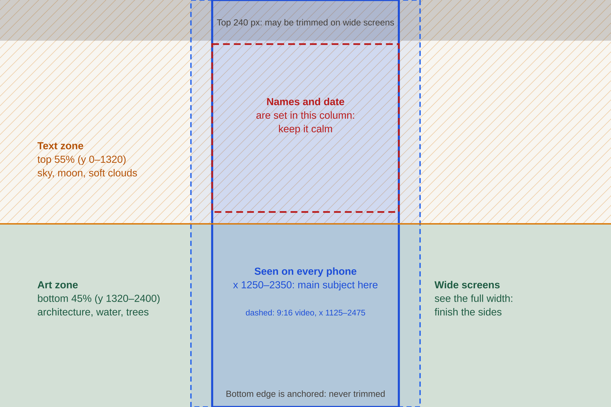

# Illustration brief: painted invitation scenes

Bulava makes digital wedding and celebration invitations for Indian families. We are commissioning **painted scenes** (temples, palaces, riverbanks, courtyards) that open our invitations. This brief explains what to paint and how to deliver it, so your painting works on every screen and in video.

## How your painting is used

One painting is used in four places:

1. **Invitation website.** It fills the opening screen of a guest's invitation on their phone. The couple's names, date and a blessing are set in the sky area. Your layers move at different speeds as the guest scrolls or tilts the phone, which makes the scene feel three-dimensional.
2. **Video invitation.** A 9:16 film (for WhatsApp status and Instagram Reels) in which a slow camera glides through your layers: pushing in, panning, rising.
3. **Image card.** A still 4:5 card for sharing and printing.
4. **Catalogue.** Small posters in our template gallery.

Because the layers move against each other, **the painting must be delivered in separate layers**, not flattened.

## Canvas

| | |
|---|---|
| Size | **3600 × 2400 px** (3:2, landscape). If you work larger, keep 3:2 (for example 7200 × 4800) and send both sizes. |
| Colour | RGB, sRGB profile |
| Orientation | Landscape. Phones show a vertical strip from the middle (see safe areas). |

Every layer is painted on this same canvas, at the same size and position, so they line up exactly when stacked.

## Safe areas

*A guide you can place as a layer in your file: [`assets/illustration-safe-areas.svg`](assets/illustration-safe-areas.svg).*

- **Phone core: x 1250 to 2350 (the middle 1100 px).** Every phone shows at least this strip, full height; taller phones show a little more, and 9:16 videos show x 1125 to 2475. **The main subject (the temple, palace or flute) must sit inside the core.**
- **Wide screens** show the whole width. The sides are the scene's surroundings: finish them properly (trees, walls, hills), since they frame the view on laptops.
- **Text zone: the top 55% (y 0 to 1320).** Names and dates are set here, centred. Keep it calm: sky, soft clouds, a moon, distant birds, gentle light. No busy detail, strong patterns or high-contrast shapes behind the centre column (x 1250 to 2350, y 260 to 1250).
- **Art zone: the bottom 45% (y 1320 to 2400).** Architecture, water, trees and the foreground live here. The painting is anchored at the bottom edge: on very wide screens the top is trimmed, never the bottom.
- **Top 10% (y 0 to 240)** may be trimmed on wide screens. Nothing essential there.

## Layers

Paint **four to six layers**, far to near. Typical scene:

| Layer | Contents | Moves |
|---|---|---|
| 1. Sky | Sky, moon or sun, distant clouds. **Opaque**, fills the whole canvas. | Barely |
| 2. Far | Horizon, distant hills, far temples or skyline | Slightly |
| 3. Middle | The main subject: temple, palace, ghat, pavilion, water | Moderately |
| 4. Near | Trees, pillars, arches and garlands framing the view | More |
| 5. Foreground | Objects close to the viewer at the bottom corners: a flute, peacock feathers, lotuses, diyas, petals | Most |

Rules for layers:

- **Each layer is a full-canvas PNG with transparency** (3600 × 2400), with everything outside that layer's objects fully transparent.
- **Paint behind what is in front.** Layers slide by up to about 4% of the width, so each layer must continue a little behind the layer in front of it: the hills go on behind the temple, the water continues under the trees. Otherwise holes appear when the scene moves.
- **Clean edges.** Use soft anti-aliased edges, and don't leave halos of the sky colour around cut-out shapes.
- **Nothing important at the very edges of near layers.** When the camera pushes in, near layers are cropped by up to about 15%.

## Readability

The names are typeset in the sky, so decide whether the scene is a **night scene** (light text on a dark sky) or a **day scene** (dark text on a light sky), and keep the text zone consistently dark or light. Avoid a sky that is half dark and half light behind the centre.

## Colour

Our customers can change the colours of their invitation's text and sections, but **painted art keeps its own colours**. If a scene suits more than one mood (for example night and dawn), we may order a second colourway as a separate layer set.

## Please don't include

- Text, lettering, names, dates, logos, signatures or watermarks (we typeset in 14 languages).
- The couple, or anyone who could look like a real person. Customers add their own photo.
- Traced, stock or third-party material, or images generated from other artists' work. Tell us if any AI tools were used, and how.
- Deities and sacred sites should be shown respectfully and accurately. Small figures or silhouettes are welcome; no caricatures.

## Delivery

| File | Details |
|---|---|
| Layers | One PNG per layer, 3600 × 2400, transparency, sRGB, under 25 MB each. Name them `<scene>-<nn>-<layer>.png`, for example `vrindavan-01-sky.png`, `vrindavan-02-far.png`. |
| Source | The layered working file (PSD/PSB, Procreate or similar). |
| Preview | A flattened JPEG of the whole scene. |
| Notes | For each layer, one line on what it contains. |

## Rights

We need rights that let us sell invitations made with your work to our customers, on demand, indefinitely:

- **Copyright assignment**, or an exclusive, perpetual, worldwide, irrevocable licence;
- for use on websites, in videos, on social media and in print, in commercial products made on demand for customers;
- including the right to crop, layer, animate, resize and adjust colours;
- no attribution required on customers' invitations (tell us if you want credit in our catalogue);
- a written agreement or invoice with a reference number, and your confirmation that the work is original.

We record the licence terms with every file, and our system refuses to publish art without a licence that allows commercial, on-demand use.

## Process

1. **Sketch** at 3:2 with the safe-area guide visible.
2. **Colour rough**, flattened. We check the text zone with real names set over it.
3. **Final layers.** We load them into our template studio and preview them on a phone, on a laptop and in video before sign-off. Small adjustments (a layer that shows a gap when it moves, for example) are part of the job.

## First scenes

Each matches an existing invitation design, so the painted version can replace the drawn one:

| Scene | Mood | Main subject in the phone core | Used by |
|---|---|---|---|
| **Vrindavan night** | Night | A golden flute and peacock feathers in the foreground; kadamba trees and a small riverside temple with lamps on the Yamuna; full moon | *Bansuri* website, *The Divine Flute* film |
| **Temple at dawn** | Day | A South Indian temple gateway (gopuram) with painted sculptures; carved pillars, bells and marigolds; red-and-white striped temple walls | *Divine Gopuram* website, *Temple Dawn* film, *Temple Card* |
| **Palace on the lake** | Night | A Rajasthani palace reflected in a lake, lit windows, sky lanterns rising | *Rajwada Royale* website, *Royal Reveal* film, *Royal Card* |
| Arched courtyard | Night | Receding Mughal arches with lamps, glowing light at the end | *Noor-e-Nikah*, *Noor Arches* |
| Golden sarovar | Night | A golden-domed pavilion over still water, a marble walkway | *Anand Karaj*, *Golden Sarovar* |
| Marigold doorway | Day | A doorway hung with a marigold toran and mango leaves, a rangoli, diyas | *Marigold Mahal* website and film |
| Wedding mandap | Day | A draped mandap with the sacred fire, kalash and marigolds | *Mangal Mandap*, *Griha Pravesh Blessings* |
| Lotus pond at dawn | Day | Lotus blooms and floating diyas on a still pond | *Shubho Bibaho*, *Lotus Blessings* |
| Kerala backwaters | Sunset | Coconut palms, a houseboat, kasavu-gold light | *Kerala Kasavu*, *Kasavu Backwaters* |
| Garden flower arch | Day | A layered arch of roses in blush and sage | *Blush & Bloom* |

The first three are the priority.
